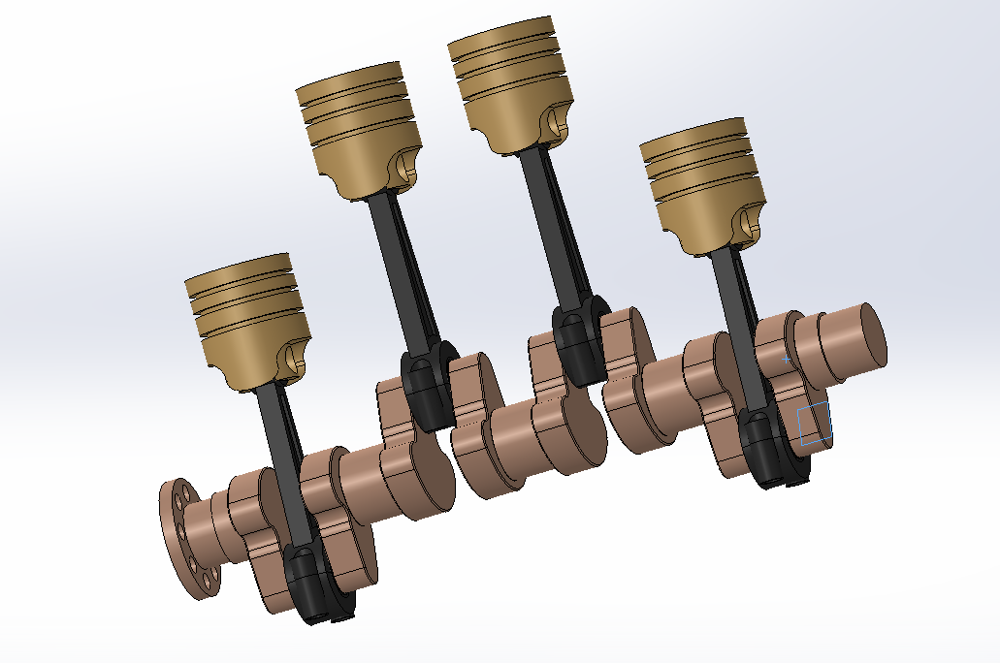
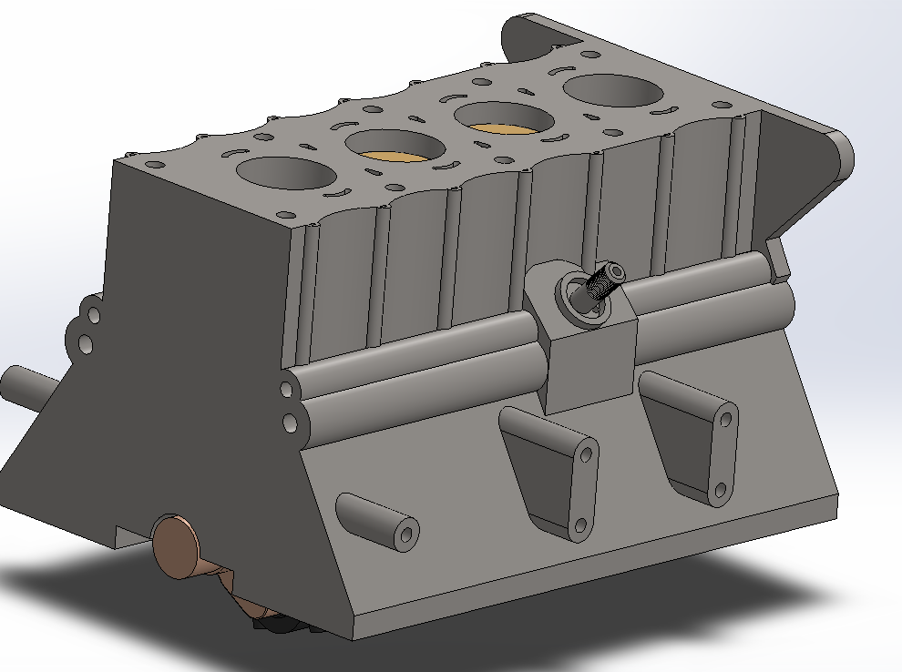

# 4-stroke-engine-

 **Project Overview**

This project includes the complete **SolidWorks assembly of a basic internal combustion engine**, showcasing various key components like the **piston**, **crankshaft**, **connecting rod**, and **engine block**.

The aim is to model mechanical motion realistically and highlight proper part interaction through parametric design and mate constraints.

---

### 🧩 **Files Included**

| File Name                     | Description                                    |
| ----------------------------- | ---------------------------------------------- |
| `Piston.SLDPRT`               | 3D model of the piston                         |
| `Connecting Rod.SLDPRT`       | Connecting rod between piston & crankshaft     |
| `Crankshaft.SLDPRT`           | Main rotating shaft                            |
| `Engine Block.SLDPRT`         | Base structure for part housing                |
| `Crankshaft Connector.SLDPRT` | Link between crankshaft and other components   |
| `Split Rod.SLDPRT`            | Supportive part used in motion                 |
| `Con Rod.SLDPRT`              | Alternate con-rod version                      |
| `Connector.SLDPRT`            | Small linkage part                             |
| `Engine_Assembly.SLDASM`      | 🔧 **Main assembly file** connecting all parts |

### 📸 **Preview**

